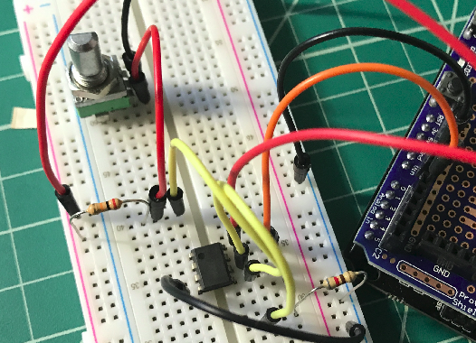

<h1>Ohmmeter-with-a-Potentiometer</h1>

<h2>Tools</h2>
<ul>
  <li>Breadboard</li>
  <li>Arduino</li>
  <li>Male to Male Wires</li>
  <li>LED</li>
  <li>LM358 op-amp</li>
  <li>1 470 &#8486; resistor</li>
  <li>1 10 k&#8486; resistor</li>
  <li>1 2 k&#8486; resistor</li>
</ul>  

<h2>Motivation for the Project</h2>

Similar to before I made another ohmmeter to measure the resistance of a resistor, but this time with a potentiometer, which served as tuner for the voltage. I tuned the voltage to provide me with the most accurate reading of the resistor’s resistance in Ohms since I since still relied on finding the resistance with Ohm’s law R = V / I. However, the Arduino code was modified to account for the potentiometer. Additionally, to verify the resistance was accurate I both identified the resistance of the resistor by observing its color bands and also using a digital multi-meter to ensure my ohmmeter on the breadboard is accurate. Hence, building this ohmmeter largely assisted me in getting comfortable with Arduino programming.

